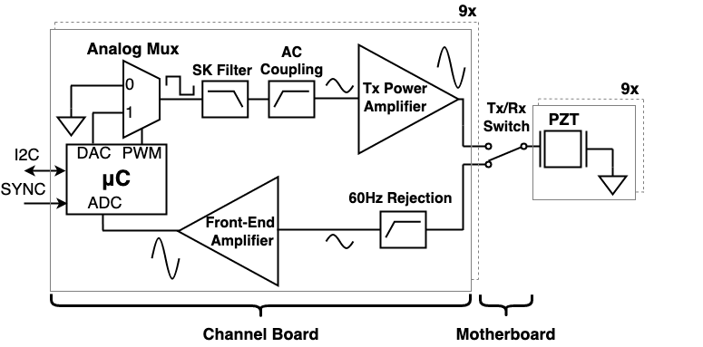
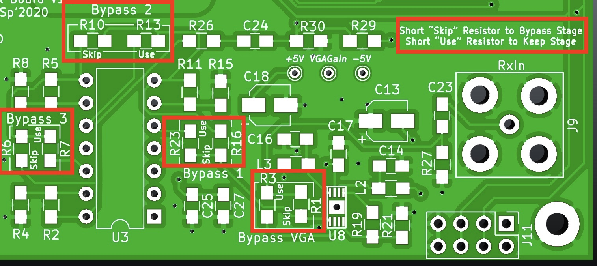

.. _ref-channelboard:

=============
Channel Board
=============

Outline
-------

This section contains information on the channel boards including their operation, features, configuration options, and connections. This section contains the KiCAD PCB files as well as Gerber fabrication outputs for manufacturing these boards. The Bill-of-Materials spreadsheet is also included.

File Structure
--------------

.. code:: text

  - pcb/
    - channel-board/
      - BOM.xlsx             <- Bill of Materials
      - BoatCentralboard.pro <- main KiCad 5 project file 
      - BoatCentralBoard.*   <- misc KiCad 5 project files
      - fp-lib-table         <- KiCad project footprint library location table
      - sym-lib-table        <- KiCad project symbol library location table
      - Fabrication Files/   <- GERBER files for fabrication

Board Overview
--------------

.. figure:: figs/channelboard.jpg
  :width: 800
  :alt: Picture of the channelboard calling out features

Each channel board is capable of driving both the transmit (TX) and receive (RX) operations for a single piezoelectric transducer in the array. An ATSAM4S microcontroller is used for PWM generation, ADC sampling, DAC output, I2C communications, and other functions. The board contains both a TX and RX analog front-end. The TX front end generates a high-voltage sinusoidal pulse to drive the transducers. This signal is output to the central motherboard with a screw terminal connector. The RX front end accepts an incoming signal from the motherboard with a BNC connector, then filters and amplifies the signal before it is sampled.  The board requires five voltage rails, typically supplied by benchtop power supplies over banana cables: ±40V, ±15V and ground. It also contains two headers at the top and bottom for the I2C and SYNC signals, so multiple channel boards can be linked on the same bus by ribbon cables. Other connectors include a JTAG programming header for the microcontroller and a screw terminal for the TX/RX switch logic signal. Due to the modular design, the entire array can be easily scaled up from the 3x3 array used in our work.

.. figure:: figs/channelboards.jpg
  :width: 800
  :alt: Picture of the channelboard layout for the 3x3 array

The nine-channel layout with the central board is shown in the above image. Note that not all connections between boards are shown.

Theory of Operation
-------------------

The channel circuitry is made of two analog front ends: a TX AFE that drives the piezoelectric transducer, and an RX AFE that amplifies and filters signals reflected back to the transducers. The image above shows a block diagram of both front-ends.

The TX AFE creates a high-voltage sinusoidal burst. The TX AFE can generate bursts with adjustable initial delays, burst amplitudes, and burst durations. When initiated by the rising edge of a digital signal called SYNC, the timer peripheral in each channel's microcontroller waits for an initial delay, then it generates a 92kHz pulse-width modulated (PWM)  signal, typically with a 100us duration. The PWM burst drives the select line of an analog multiplexer, which causes the output of the multiplexer to switch between ground and a digital-to-analog converter (DAC) voltage.  The DAC voltage is also generated by the microcontroller. The multiplexer output is driven into a set of amplifiers and filters, and because the amplifiers and filters have a fixed gain, the transmitted signal's amplitude is controlled by the DAC voltage.

One of the circuits in the TX AFE signal chain is a Sallen-Key low pass filter that is used to filter harmonics out of the multiplexer output.  Removing these harmonics converts the output from a square wave to a sine wave.  The output of the Sallen-Key filter is AC-coupled into a linear audio amplifier (the LM3886T), which amplifiers the signal to a maximum voltage swing of ±40V. The output of the amplifier is connected to a TX/RX switch (located on the central board), which in turn is connected to the piezoelectric transducers.

The RX AFE on each channel amplifies the signal with a high gain, then samples the signal coherently with the other channels. The first stage of the RX front-end is a first-order high-pass filter used for AC coupling and 60Hz rejection. The remaining stages comprise a multi-stage op-amp-based
amplifier. The final stage of the voltage amplifier drives a series current limiting resistor, AC coupling capacitor, and voltage divider used to bias the signal to a 0-3.3V range. The RX AFE output is sampled at 1 MSPS by a 12-bit ADC (with 10.5 effective bits) embedded in the channel microcontroller. Each channel's ADC used the same 1MHz clock in order to synchronize the samples. Sampling is triggered by the falling edge of the SYNC signal. Data is stored in RAM via DMA transfer and is offloaded back to the host computer for processing after sampling is complete.

Configuration Options
---------------------

The channel board offers a few options to reconfigure the TX and RX analog front-ends.

The TX Sallen-Key filter is designed to have a corner frequency near the resonant frequency of our specific transducers, which is 92kHz. The resistor and capacitor values of this filter can be changed depending on the resonant frequency of your transducers.

The RX 1st-order RC high-pass filter (R27 and C23) is tuned to reject 60Hz mains pass-through that was in our testing environment. This can be tuned to your needs, as well.

The RX amplifier chain has several 0Ω resistor population options that can change the final gain of the RX signal, as seen in the above image. There are three non-inverting amplifiers, each with a gain of approximately 20.8dB. For our tests, a gain of 41.6 dB is used (two amplifier stages are used, one is skipped).

There is a population option for an AD8337 Variable Gain Amplifier (VGA) on these boards. The gain control voltage is provided by the second DAC channel on the microcontroller. This component was not populated for our tests, and we recommend that this component not be populated if unused.

The board includes test points for the signal at each stage of the TX chain. There are also test points for all voltage rails. Indication LEDs also display whether a voltage rail is on or not.

Power Connections
-----------------

The five voltage rails — ±40V, ±15V and ground — can be supplied via banana cables from benchtop power supplies. The ±15V rail is used to generate 5V and 3.3V rails, and the -15V rail is used to generate the -5V rail on the board. The ±40V rails are used for the TX audio power amplifier.

Clock Distribution
------------------

.. figure:: figs/adc_clock_input.jpg
  :width: 800
  :alt: Figure showing the sample clock input pin

A shared 1MHz clock must be distributed to each channel board by soldering wires to the appropriate through-hole connection on the channel board. This signal is used to generate each channel’s ADC sampling clock. The shared clock bus ensures that each channel has a synchronized sample period.

Programming Guide
-----------------

To program the channel microcontrollers the 15V rail must be provided so that the microcontrollers receive 3.3V. Plug in the JTAG connector from your programming device to the board with the correct orientation. Further instructions can be found in :ref:`ref-flashingboards`.

-- Tejus Rao
